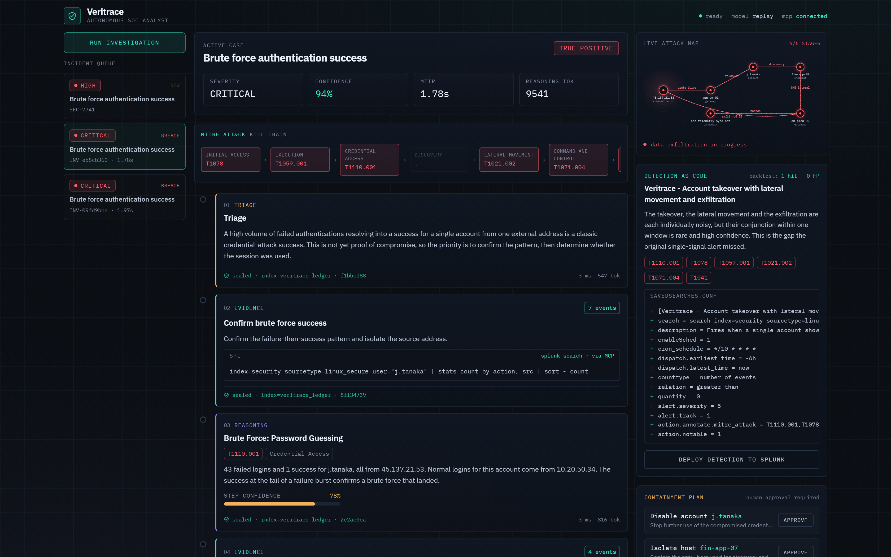
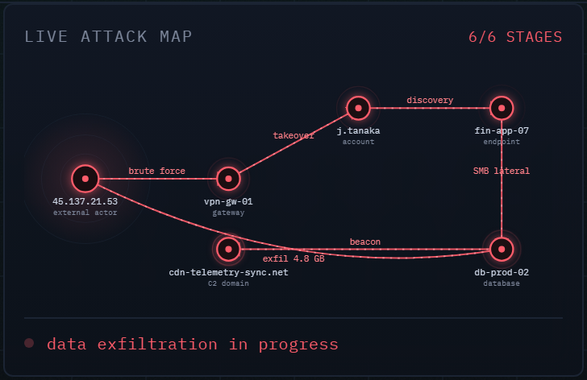
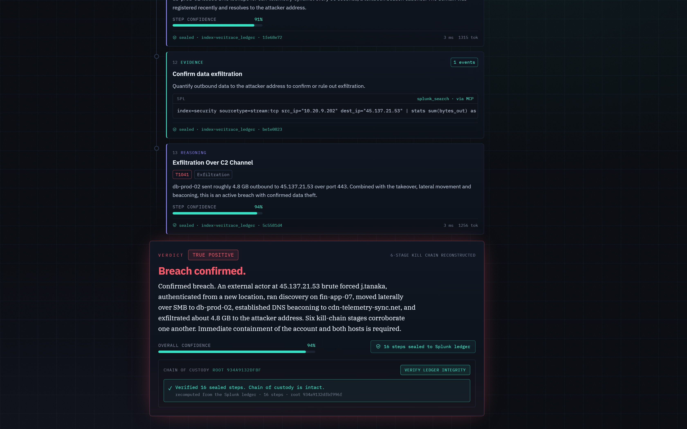

# Veritrace

**An autonomous Tier-1 SOC analyst for Splunk that proves every step.**

Veritrace investigates a Splunk alert the way a good analyst does. It pulls
evidence from Splunk over the MCP Server, reasons with the Foundation-Sec
cybersecurity model, writes its full chain of evidence, reasoning, confidence
and actions back into Splunk as a verifiable, replayable ledger, and ships a
tuned detection-as-code rule that closes the gap it found. It proposes
containment for a human to approve and never takes a destructive action on its
own. It never sleeps, it shows its work, and it leaves the SOC stronger than it
found it.

Track: **Security**. Built on the Splunk MCP Server, the Splunk-hosted
Foundation-Sec model, and the Splunk developer tools (Python SDK, `splunklib.ai`
patterns, and App Inspect).



> Architecture and data flow: see [architecture_diagram.md](architecture_diagram.md).

---

## The problem

Security teams want to put AI agents into the SOC, because Tier-1 triage is
repetitive, alert volume is crushing, and analysts burn out. The blocker is
trust. An agent that takes actions you cannot audit is a non-starter in
security. If an agent says "this is a breach, I disabled the account," an
analyst has to be able to see exactly why, check the evidence, and stand behind
the decision.

Veritrace is built around that trust problem. Every claim it makes carries a
pointer back to the Splunk events that support it. Every step it takes is
written back into Splunk as structured data you can search, audit and replay.
The agent is a glass box, not a black box.

## What it does

1. **Triage.** An alert fires in Splunk (or you trigger one from the console).
   Veritrace reads it and forms a hypothesis.
2. **Investigate over MCP, discover the attack from the data.** It runs a chain
   of read-only detections through the Veritrace MCP Server and finds the
   malicious entities by behaviour and correlation, not by assuming them: the
   brute-force source by its failure-to-success ratio, the compromised host by
   the suspicious commands the account ran, the lateral-movement target by a
   subsearch that keeps only the SMB peer that also exfiltrates to the attacker,
   and the C2 domain by the DNS answer that resolves to the attacker. Each entity
   it discovers feeds the next detection, so it investigates whatever incident
   the data actually shows, not a hard-coded one.
3. **Reason with Foundation-Sec.** The model interprets each real result, scores
   its own confidence, and reconstructs the kill chain end to end, then renders
   the verdict. The ATT&CK technique for each detection is deterministic, so the
   mapping is always correct.
4. **Write a tamper-evident ledger.** Every step, the SPL it ran, the evidence
   count, its reasoning, its confidence and its token cost, is written back into
   `index=veritrace_ledger` as it happens. Each step is hash-chained to the one
   before it, so the ledger is a verifiable chain of custody: the console can
   re-read the steps straight out of Splunk and prove the chain is intact, and
   altering, dropping or reordering any single entry breaks it at that step. The
   console renders the investigation live; the bundled dashboard replays it later.
5. **Ship detection-as-code.** It authors a higher-fidelity correlation
   detection that would have caught this incident as one signal, backtests it
   against history, and hands you a `savedsearches.conf` stanza ready to deploy.
   The model designs the detection in plain terms; the platform compiles the SPL
   from the stages the investigation actually proved, so the query is always
   valid and grounded in evidence rather than freehand model output.
6. **Propose containment.** It recommends reversible containment actions for a
   human to approve. Nothing destructive runs automatically.



The verdict carries a **chain of custody** you can verify. "Verify ledger
integrity" re-reads the sealed steps from Splunk and recomputes the hash chain,
so the audit trail is provable, not just present:



## How the AI is used

- The reasoning engine is **Foundation-Sec-1.1-8B-Instruct**, the Cisco
  Foundation AI cybersecurity model that Splunk hosts. On Splunk Cloud it is
  reachable from SPL through the AI Toolkit `ai` command. On Splunk Enterprise,
  Veritrace serves the same open weights locally through Ollama or vLLM. The
  model provider is pluggable, so you can point it at whichever path you have.
- The agent reaches Splunk **only through MCP tools**, each of which passes an
  SPL safety guardrail. The agent cannot run a write, execute or export command
  against the platform.
- An 8B model is held to a tight contract. Every decision point asks for a single
  JSON object with **JSON-constrained decoding** (`format=json` on Ollama,
  `response_format` on vLLM), so the reasoning parses reliably. Anything the model
  should not be trusted to write, above all the detection SPL, is **assembled by
  code from the proven attack chain**, so the output is always valid.
- The model is used for what a small security model is reliable at: **interpreting
  each real result, scoring confidence and judging the verdict**. Authoring correct
  multi-stage correlation SPL is not one of those things, so with
  `VERITRACE_GUIDED_PIVOTS=true` (recommended for the local model) the agent runs a
  **detection chain that discovers each malicious entity from the data**
  (`veritrace/soc.py`) and the model interprets the live evidence each detection
  returns. The discriminators are behavioural, so the same engine investigates a
  different account-takeover incident with different addresses, hosts and domains;
  it is not pinned to one scenario. The searches and results are real Splunk
  throughout.
- A deterministic **replay** provider reproduces a full investigation with no
  GPU and no network, which is what the test suite and the offline demo use, so a
  recorded run is identical every time without giving up the real model path.

## Quickstart

You need [Docker](https://www.docker.com/) for the one-command path. Everything
runs with a deterministic reasoning provider by default, so no GPU is required.

```bash
git clone https://github.com/tejcodes-rex/veritrace.git
cd veritrace
cp .env.example .env
docker compose up --build
```

This brings up Splunk Enterprise, provisions the indexes and HEC, loads a
realistic breach into `index=security`, starts the Veritrace MCP Server and the
agent backend, and serves the console.

- Console: http://localhost:8400
- Splunk Web: http://localhost:8000 (user `admin`, password `Veritrace!2026`)

Open the console and press **Run investigation**. Watch the agent pivot through
Splunk, build the MITRE kill chain, reach a verdict, and propose a detection.

### Use the real Foundation-Sec model

To run the investigation against the actual Foundation-Sec model instead of the
replay provider, install [Ollama](https://ollama.com/), pull the model, and set
the provider:

```bash
# Q4_K_M (~5 GB) fits an 8 GB GPU. The official fdtn-ai Q8_0 build is higher
# fidelity if you have more memory.
ollama pull hf.co/mradermacher/Foundation-Sec-8B-Instruct-GGUF:Q4_K_M
# in .env:
#   VERITRACE_MODEL_PROVIDER=ollama
#   OLLAMA_MODEL=hf.co/mradermacher/Foundation-Sec-8B-Instruct-GGUF:Q4_K_M
#   VERITRACE_GUIDED_PIVOTS=true
docker compose up --build
```

With the local 8B model, keep `VERITRACE_GUIDED_PIVOTS=true`: the agent then
runs the proven investigation pivots over real Splunk and the model interprets
each live result, which a small model does reliably, rather than authoring its
own multi-stage SPL, which it does not.

Foundation-Sec-8B-Instruct is the open-weight build of the same Cisco Foundation
AI model family that Splunk hosts (Splunk Cloud hosts the 1.1 revision). On
Splunk Cloud you can instead set `VERITRACE_MODEL_PROVIDER=splunk_hosted`, which
routes reasoning through the AI Toolkit `ai` SPL command and uses the hosted
copy with no local GPU.

### Run without Docker (native)

If you already run Splunk Enterprise locally (for example the 60 day trial),
you can run Veritrace natively against it:

```bash
python -m venv .venv
.venv\Scripts\pip install -e .          # or .venv/bin/pip on macOS / Linux
copy .env.example .env                   # set SPLUNK_HOST / SPLUNK_PASSWORD

.venv\Scripts\veritrace init             # create indexes + HEC, load sample data
.venv\Scripts\veritrace mcp-server       # in one terminal
.venv\Scripts\veritrace serve            # in another terminal
```

Open http://localhost:8400. Build the console separately with `cd console && npm
install && npm run build` if you want it served by the backend, or run `npm run
dev` for the dev server.

### Offline, no Splunk and no GPU

```bash
.venv\Scripts\veritrace investigate --provider replay --backend direct
```

This prints a full investigation to the terminal. The test suite runs the same
path:

```bash
.venv\Scripts\pytest -q
```

## The demo scenario

The bundled data contains two weeks of benign baseline plus an embedded
intrusion. An external actor at `45.137.21.53` brute forces the account
`j.tanaka`, logs in from a new location, runs discovery on `fin-app-07`, moves
laterally over SMB to `db-prod-02`, beacons to `cdn-telemetry-sync.net`, and
exfiltrates about 4.8 GB to the attacker. Veritrace unravels all six stages and
maps them to MITRE ATT&CK (T1110.001, T1078, T1059.001, T1021.002, T1071.004,
T1041).

## Proven to generalize, not hard-coded

Veritrace is not pinned to one scripted incident. The bundled data embeds two
distinct intrusions with entirely different entities, and the same detection
engine solves each one by discovering its attack from the data:

| | Incident 1 | Incident 2 |
|---|---|---|
| Attacker IP | `45.137.21.53` | `203.0.113.66` |
| Account | `j.tanaka` | `r.dasilva` |
| Entry host | `fin-app-07` | `fin-app-05` |
| Lateral target | `db-prod-02` | `db-prod-01` |
| C2 domain | `cdn-telemetry-sync.net` | `edge-metrics-sync.net` |

The agent is handed only the alert (the account and the source). It discovers
the compromised host, the lateral-movement target and the C2 domain from the
data every time. Run either one and watch:

```bash
.venv\Scripts\veritrace investigate --incident 1
.venv\Scripts\veritrace investigate --incident 2
```

## The Splunk app

`splunk_app/veritrace_app` is a proper Splunk app that passes App Inspect with
zero failures. It ships the trigger alert, a custom alert action that hands the
firing alert to Veritrace, the proposed correlation detection, and a reasoning
ledger dashboard. Validate it yourself:

```bash
.venv\Scripts\pip install splunk-appinspect
.venv\Scripts\splunk-appinspect inspect splunk_app/veritrace_app
```

## Project layout

```
veritrace/            the agent, MCP server, model providers, ledger, API, CLI
  agent.py            the investigation loop
  mcp_server.py       the Veritrace MCP server (FastMCP)
  mcp_client.py       the MCP client the agent uses
  evidence.py         evidence sources (MCP, direct SDK, fixture)
  models/             pluggable providers (ollama, vllm, splunk_hosted, replay)
  ledger.py           writes the reasoning ledger into Splunk
  detection.py        detection-as-code generation and backtest
  scenarios.py        the reference incident, shared by data, replay and agent
  data/generator.py   CIM-aligned sample telemetry with the embedded breach
  server.py           FastAPI backend and live SSE stream
console/              the React console (the glass-box UI)
splunk_app/           the Splunk app (passes App Inspect)
tests/                offline end-to-end investigation test
```

## Configuration

All settings have working defaults for the bundled stack. See
[.env.example](.env.example) for the full list, including Splunk connection,
the MCP URL, and the model provider.

## Security notes

- The agent only reaches Splunk through MCP tools, and every search passes an
  SPL guardrail that blocks write, execute and export commands.
- Containment actions are proposed for human approval. Automatic execution is
  off by default.
- The reasoning ledger is data, so normal Splunk role based access control
  governs who can read an investigation.

## License

Apache-2.0. See [LICENSE](LICENSE).
