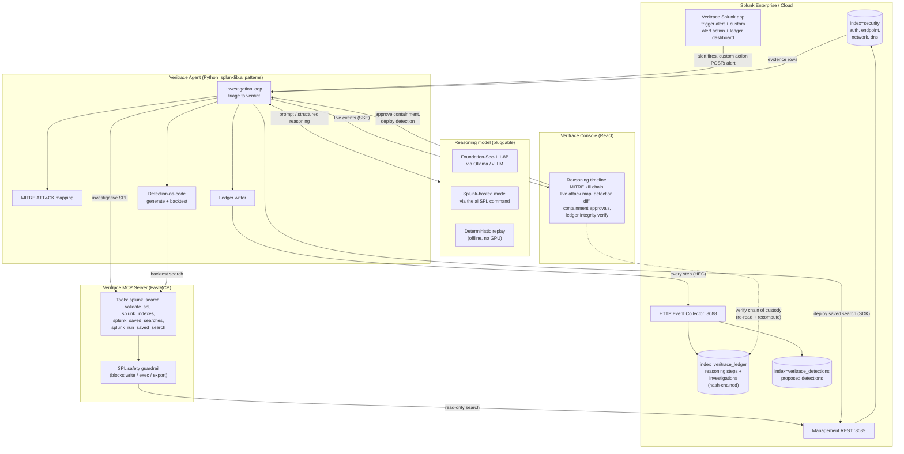
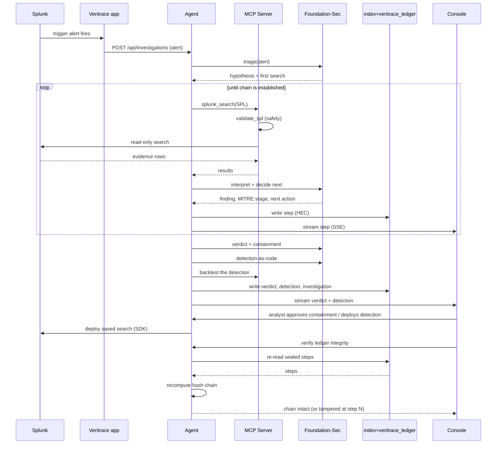

# Veritrace Architecture

Veritrace is an autonomous Tier-1 SOC analyst for Splunk. It investigates an
alert by pivoting through Splunk over the MCP Server, reasons with the
Foundation-Sec model, records every step back into Splunk as a verifiable
ledger, and proposes a tuned detection-as-code rule. This document shows how the
pieces fit, how the AI is integrated, and how data flows between them.

## System architecture

## Investigation sequence

## How the AI is integrated

- **Reasoning engine.** Each decision point (triage, interpret-and-pivot,
  verdict, detection authoring) is a structured call to the Foundation-Sec
  cybersecurity model with JSON-constrained decoding, so the 8B model's output
  parses reliably into typed objects. If a model ever returns text that cannot be
  parsed, the agent falls back to a deterministic playbook for that one decision
  so an investigation never stalls; the searches always run for real.
- **Code assembles what the model should not.** The model designs the correlation
  detection in plain terms, but the detection SPL is compiled by code from the
  stages the investigation actually proved, so the query is always valid and
  grounded in evidence rather than freehand model SPL.
- **Model is pluggable.** The same agent runs against Foundation-Sec served
  locally (Ollama or vLLM), the Splunk-hosted Foundation-Sec model through the
  AI Toolkit `ai` SPL command on Splunk Cloud, or a deterministic replay
  provider that needs no GPU for tests and offline demos.
- **The agent only touches Splunk through MCP.** Every search is a typed MCP
  tool call that passes an SPL safety guardrail, so the agent's access to the
  platform is named, audited and read-only at the boundary.

## Data flow

1. A scheduled saved search in the Veritrace Splunk app detects a single-signal
   anomaly and the custom alert action posts the alert to the agent.
2. The agent runs a sequence of read-only SPL searches through the MCP Server to
   gather authentication, endpoint, network and DNS evidence from
   `index=security`.
3. The agent's detection engine correlates on the entities discovered so far
   (the affected account, then the brute-force source) to drive the next pivot,
   and the Foundation-Sec model interprets each result, maps it to MITRE ATT&CK
   and scores confidence, building the kill chain end to end.
4. Every step (the SPL, the evidence count, the model's reasoning, the
   confidence, the latency and token cost) is written back into
   `index=veritrace_ledger` over HTTP Event Collector as it happens, each step
   hash-chained to the previous one so the ledger is a tamper-evident chain of
   custody. The console can re-read the steps from Splunk and recompute the chain
   to prove the investigation was not altered.
5. The agent issues a verdict, proposes reversible containment for human
   approval, and authors a higher-fidelity correlation detection that it
   backtests against history. The detection lands in
   `index=veritrace_detections` and can be deployed to Splunk as a saved search.
6. The console renders the whole investigation live over Server-Sent Events, and
   the ledger dashboard lets anyone search and replay it inside Splunk later.
